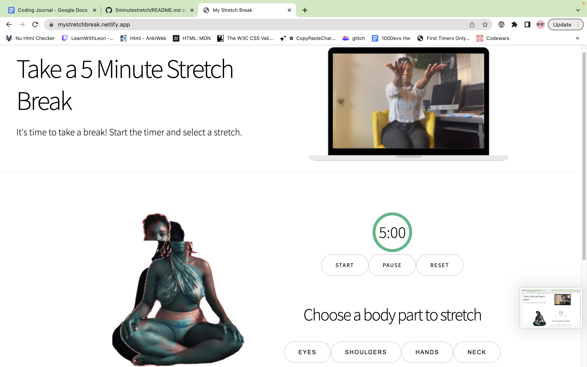
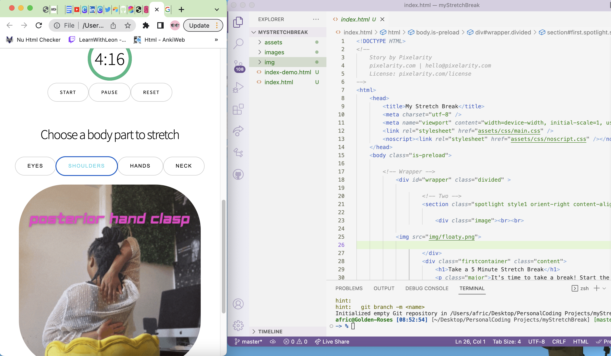

# My Stretch App
This full-stack web application is for tech professionals who work at a computer all day. It allows users to set a 5-minute timer for a stretch break at the top of each hour. Users can click on which body part they would like to focus on during their break, which will display a gif from an array of images randomly on click.

Link to project: https://mystretchbreak.netlify.app/

Note: This web app is still under construction and may display errors when using the live link.

  

## How It's Made:
Tech used: HTML, CSS, JavaScript, Tech to be added: Nodejs, Express, MongoDB

- HTML was used to create the skeleton of the webpage and add information, including alt text to images and buttons.
- Vanilla CSS was used to construct the style of the page, given a very simple format.

Javascript was used to add in functions for page elements including:

- Displaying a random gif from an array of images on click
- Starting a 5-minute countdown timer
- Stopping a timer once timer hit 0 seconds
- Resetting a timer while counting down from a set amount of seconds

## To be added:

- Adding in working "resetTimer" and "stopTimer" function
- Backend functions including bringing timer function serverside
- Creating a database of images and gifs that include yoga poses categorized by body part to increase speed and efficiency

## Optimizations
To be added:

- Placing images in cloud storage
- Updating HTML for accessibility
- Simplifying functions for more efficiency

## Lessons Learned:
- How to make a timer using setInterval and clearInterval
- How to get an image to display from an array of images randomly

- How to style CSS so that images from multiple containers can display in one area while leaving elements hidden until called

- How to style CSS so that images from multiple containers can display in one area while leaving elements hidden until called

